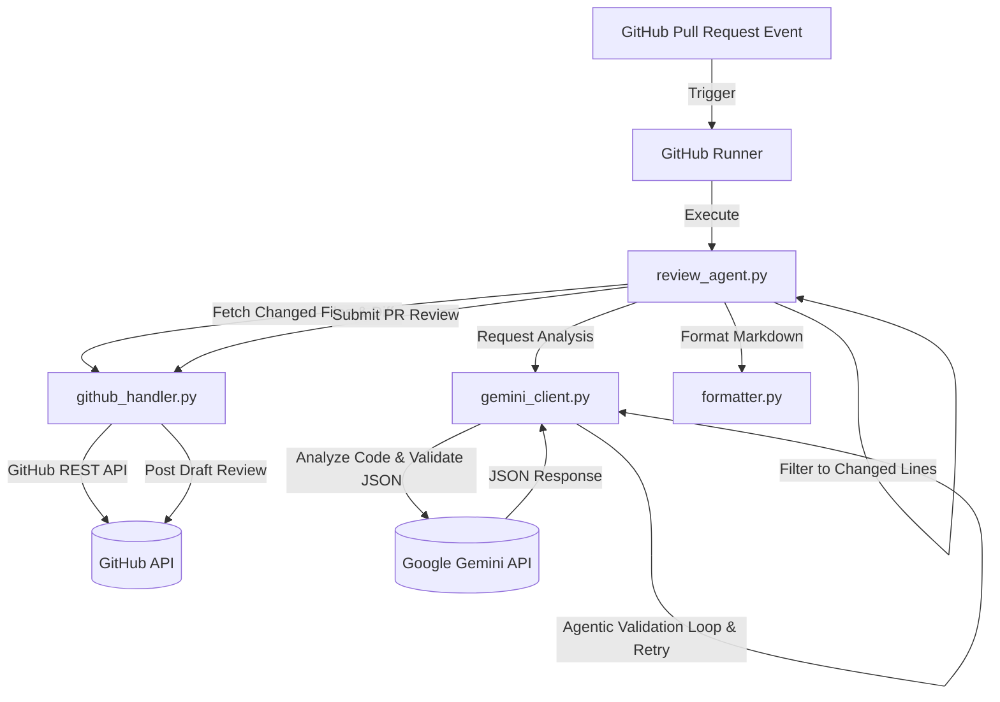

# Architecture & System Design

This document details the system design, components, and data flows of the **AI Code Reviewer GitHub Action**.

## System Overview

The system is a modular, event-driven CI/CD agent designed to automatically review C# code changes in pull requests. It leverages the Google Gemini API to analyze C# code against industry-standard engineering guidelines (SOLID principles, Null Handling, and Async/Await correctness) and posts inline review comments back to GitHub.

---

## Key Components

### 1. Orchestrator (`review_agent.py`)
- Coordinates the workflow of fetching code, invoking analysis, filtering findings, formatting findings, and posting review comments.
- Handles environment setup, argument parsing (including dry-run mode), and system logging.

### 2. GitHub Handler (`github_handler.py`)
- Connects to GitHub using the `PyGithub` library.
- Fetches metadata for modified files in the pull request.
- **Diff Parsing:** Extracts specific line numbers that were added/modified in the PR using unified diff headers (`@@`) and line symbols (`+`/`-`). This ensures that the reviewer agent only posts inline comments on lines of code modified by the author.
- Reads file contents locally or falls back to the GitHub API if local files are missing.
- Packages comments and posts them as a single consolidated Pull Request Review (using `REQUEST_CHANGES` or `APPROVE` based on finding counts).

### 3. Gemini Client (`gemini_client.py`)
- Interfaces with the `google-generativeai` SDK.
- Configures generation options including `response_mime_type: "application/json"` and low `temperature` to ensure deterministic structured outputs.
- **Agentic Self-Correction Loop:**
  - Validates the response structure using `Pydantic` schemas.
  - If a validation or formatting error is caught (e.g. invalid JSON, missing required fields, or illegal values), the client logs the attempt, constructs a repair request containing the specific syntax error and the bad payload, and requests correction from the model.
  - Retries up to 2 times (3 total attempts) before falling back to a safe empty structure.

### 4. Formatter (`formatter.py`)
- Formats individual line findings into clean Markdown tables indicating severity (High 🔴, Medium 🟡, Low 🔵), category, problem statement, and actionable fix suggestions.
- Generates a high-level summary review description for the PR review body, listing affected files and breakdown statistics.

---

## Data Flow

1. **Trigger:** A developer opens or synchronizes a pull request changing C# (`.cs`) files.
2. **Setup:** The GitHub Action starts a runner, checks out the code, installs Python packages, and executes `review_agent.py`.
3. **Fetch & Parse:** The script fetches changed files and unified patches. It compiles a dictionary of files, their current code contents, and the sets of line numbers added/modified in the PR.
4. **Analyze & Validate:** For each C# file:
   - The script sends the full file content to Gemini with the analysis instructions from `review_prompt.txt`.
   - The Gemini Client ensures the output is valid JSON using Pydantic. If invalid, the repair loop triggers automatically.
5. **Filter Findings:** Findings are cross-referenced with the changed line numbers. Findings residing on unmodified lines are filtered out to avoid review spam.
6. **Submit Review:** Remaining findings are formatted as inline review comments and submitted along with a summary markdown page back to the GitHub pull request.
